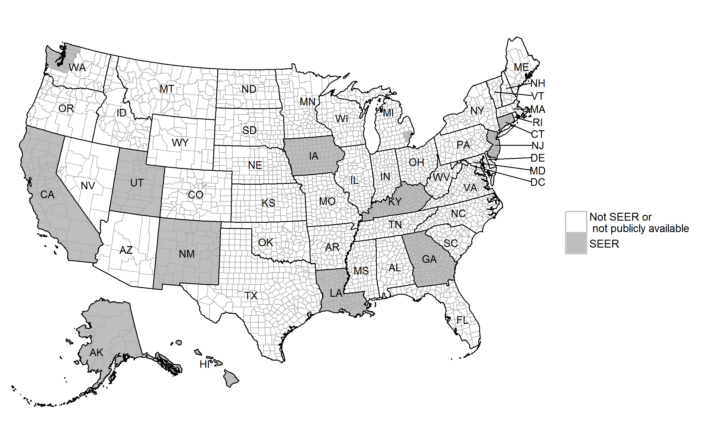

# SEER (solid tumor)
R code for SEER data analysis of solid tumor in different populations.

### Goal
Create reproducible report for different cancer types and parameters with minimum modifications on user’s side to observe patterns of different cancer types in populations. 

### Data source
<https://seer.cancer.gov/data/access.html>

The Surveillance, Epidemiology, and End Results (SEER) Program of the National Cancer Institute (NCI) collects and publishes cancer data through a coordinated system of strategically placed cancer registries which cover near 30% of the USA population. 
Currently there are 18 SEER registries in the USA.

### Parameters in the code
* Years of diagnoses (2004+);
* Age groups at diagnosis;
* Cancer type (defined by ICD-O-3 codes together with Histology codes);
* Which SEER registry to compare with other 17 SEER registries;
* How to describe the extent of disease progression in cancer patients (by American Joint Committee on Cancer (AJCC) staging system or Grade system);
* Which edition of AJCC staging to apply (6th or combination of 6th and 7th);

Some other parameters are also available to be edited, but they are secondary.

### Statistics in the report
* Characteristics of study participants
* Crude incidence rates by strata
* Age-adjusted incidence rates by strata
* Kaplan-Meier survival curves
* Cox proportional hazards models


### Directions
__1.  Create this folders' structure:__
```
|   Project_SEER_solid_tumor.Rproj  - always start a new R session by opening this file first
|   
+---code
|   +---generic
|   |       analyze.R
|   |       functions.R
|   |       map_SEER.R
|   |       map_template.R
|   |       subset.R
|   |       
|   \---specific
|       \---Colorectal
|               main.R              - main file, which controls all other files
|               report_docx_html.Rmd
|               styles_docx.docx
|               
\---data
    +---case_listing
    |       caselisting_data.dic    - download from SEER*Stat prior running the code and place under this name
    |       caselisting_data.txt    - download from SEER*Stat prior running the code and place under this name
    |       
    +---intermediate
    \---public
        \---data_geo
                mapcoord.RData
```

Additional subfolders and files should be automatically generated by running code in 'main.R' file:
```
|   Project_SEER_solid_tumor.Rproj
|   
+---code
|   +---generic
|   |       analyze.R
|   |       functions.R
|   |       map_SEER.R
|   |       map_template.R
|   |       subset.R
|   |       
|   \---specific
|       \---Colorectal
|               main.R
|               report_docx_html.docx  - automatically generated Word style report
|               report_docx_html.html  - automatically generated HTML style report
|               report_docx_html.Rmd
|               styles_docx.docx
|               
+---data
|   +---case_listing
|   |   |   caselisting_data.dic
|   |   |   caselisting_data.txt
|   |   |   
|   |   \---Colorectal
|   |           reg_inc.csv
|   |           reg_surv.csv
|   |           us_inc.csv
|   |           us_surv.csv
|   |           
|   +---intermediate
|   |   \---Colorectal
|   |           flow_charts.Rdata
|   |           icdo3_recode.Rdata
|   |           popdata.Rdata
|   |           pop_std.Rdata
|   |           results_of_analyze.RData
|   |           table1.Rdata
|   |           
|   \---public
|       |   stdpop.19ages.txt
|       |   us.1990_2015.19ages.adjusted.txt
|       |   
|       \---data_geo
|               mapcoord.RData
|               
\---figures
    |   SEER_covered_areas.png
    |   
    \---Colorectal
            many PNG files

```
__2. Download data from SEER Program__

2.1. Request access <https://seer.cancer.gov/data/access.html>;
2.2. Install SEERStat when access is granted;
2.3. Download all records from SEERStat’s 'Case Listing Session' by following rules:

I. In Selection Tab of SEERStat: 
a) uncheck all boxes 
b) {Race, Sex, Year Dx, Registry, County.Year of diagnosis} = '2004','2005','2006','2007','2008','2009','2010','2011','2012','2013','2014'

II. In Table Tab of SEERStat pre-select columns to speed up download of the data 
Columns: "Age recode with <1 year olds",	
	"Race recode (White, Black, Other)",	
	"Sex",	
	"Year of diagnosis",	
	"SEER registry",	
	"County",	
	"State-county",	
	"CHSDA 2012",	
	"State",	
	"Site recode ICD-O-3/WHO 2008",	
	"Behavior recode for analysis",	
	"Primary Site - labeled",	
	"Primary Site",	
	"Histologic Type ICD-O-3",	
	"Behavior code ICD-O-3",	
	"Grade",	
	"Diagnostic Confirmation",	
	"ICD-O-3 Hist/behav",	
	"ICD-O-3 Hist/behav, malignant",	
	"Histology recode - broad groupings",	
	"Histology recode - Brain groupings",	
	"Derived AJCC Stage Group, 7th ed (2010+)",	
	"Derived AJCC Stage Group, 6th ed (2004+)",	
	"Breast - Adjusted AJCC 6th Stage (1988+)",	
	"Derived AJCC - Flag (2004+)",		
	"Summary stage 2000 (1998+)",	
	"SEER historic stage A",	
	"COD to site recode",	
	"SEER cause-specific death classification",",	
	"SEER other cause of death classification",	
	"Survival months",	
	"Survival months flag",	
	"COD to site rec KM",	
	"Vital status recode (study cutoff used)",	
	"Type of follow-up expected",	
	"Sequence number",	
	"First malignant primary indicator",	
	"Age recode with single ages and 85+",	
	"Race recode (W, B, AI, API)",	
	"Origin recode NHIA (Hispanic, Non-Hisp)",	
	"Age at diagnosis",	
	"Year of birth",	
	""Month of diagnosis",	
	"Month of diagnosis recode",	
	"Patient ID",	
	"Type of Reporting Source",	
	"Insurance Recode (2007+)",	
	"Marital status at diagnosis"	

III.  Execute session.

IV. Matrix -> Export -> Results as Text file -> save (.txt & .dic files fill be generated) under names 'caselisting_data.txt' and 'caselisting_data.dic' in ./data/case_listing.

__3. Run code in 'Main.R' file for Colorectal cancer typecases__

Running 'Main.R' should be enough to generate reports.

In case of any issues here are directions on how to run code line-by-line (with all dependencies run separately):

```
-sequence-  -file-     -lines-
1.          main.R      1-179
2.          analyze.R   1-47
3.          subset.R    All        - the most time concuming part
4.          analyze.R   55-1002
5.          map_SEER.R  All
6.          analyze.R   1008-1016
7.          main.R      185-209
```

__4. Run code with different parameters__


### 50 states map
The map can be reproduced without access to SEER data files.
To do this you will need to download only 3 files: 'map_SEER.R' (from this GitHub repository), 'mapcoord.RData' (from this GitHub repository), and 'us.1990_2015.19ages.adjusted.txt' (see a link shown in comments in 'map_SEER.R'). 
Don't forget to modify file pathes in 'map_SEER.R'. Here is a map:



### Session Information
```
R version 3.4.2 (2017-09-28)
Platform: x86_64-w64-mingw32/x64 (64-bit)
Running under: Windows 7 x64 (build 7601) Service Pack 1

Matrix products: default

locale:
[1] LC_COLLATE=English_United States.1252 
[2] LC_CTYPE=English_United States.1252   
[3] LC_MONETARY=English_United States.1252
[4] LC_NUMERIC=C                          
[5] LC_TIME=English_United States.1252    

attached base packages:
[1] stats     graphics  grDevices utils     datasets  methods   base     

other attached packages:
 [1] bindrcpp_0.2      R.utils_2.5.0     R.oo_1.21.0      
 [4] R.methodsS3_1.7.1 knitr_1.17        rmarkdown_1.6    
 [7] rgdal_1.2-12      rgeos_0.3-25      mapproj_1.2-5    
[10] maps_3.2.0        maptools_0.9-2    sp_1.2-5         
[13] plotrix_3.6-6     gridExtra_2.3     forcats_0.2.0    
[16] stringr_1.2.0     scales_0.5.0      survival_2.41-3  
[19] SEER2R_1.0        dplyr_0.7.4       purrr_0.2.3      
[22] readr_1.1.1       tidyr_0.7.1       tibble_1.3.4     
[25] ggplot2_2.2.1     tidyverse_1.1.1   plyr_1.8.4       

loaded via a namespace (and not attached):
 [1] Rcpp_0.12.13     lubridate_1.6.0  lattice_0.20-35  png_0.1-7       
 [5] assertthat_0.2.0 rprojroot_1.2    digest_0.6.12    psych_1.7.8     
 [9] R6_2.2.2         cellranger_1.1.0 backports_1.1.1  evaluate_0.10.1 
[13] highr_0.6        httr_1.3.1       rlang_0.1.2      lazyeval_0.2.0  
[17] readxl_1.0.0     Matrix_1.2-11    labeling_0.3     splines_3.4.2   
[21] foreign_0.8-69   munsell_0.4.3    broom_0.4.2      compiler_3.4.2  
[25] modelr_0.1.1     pkgconfig_2.0.1  mnormt_1.5-5     htmltools_0.3.6 
[29] tidyselect_0.2.0 grid_3.4.2       nlme_3.1-131     jsonlite_1.5    
[33] gtable_0.2.0     magrittr_1.5     stringi_1.1.5    reshape2_1.4.2  
[37] xml2_1.1.1       tools_3.4.2      glue_1.1.1       hms_0.3         
[41] yaml_2.1.14      parallel_3.4.2   colorspace_1.3-2 rvest_0.3.2     
[45] bindr_0.1        haven_1.1.0     
```
